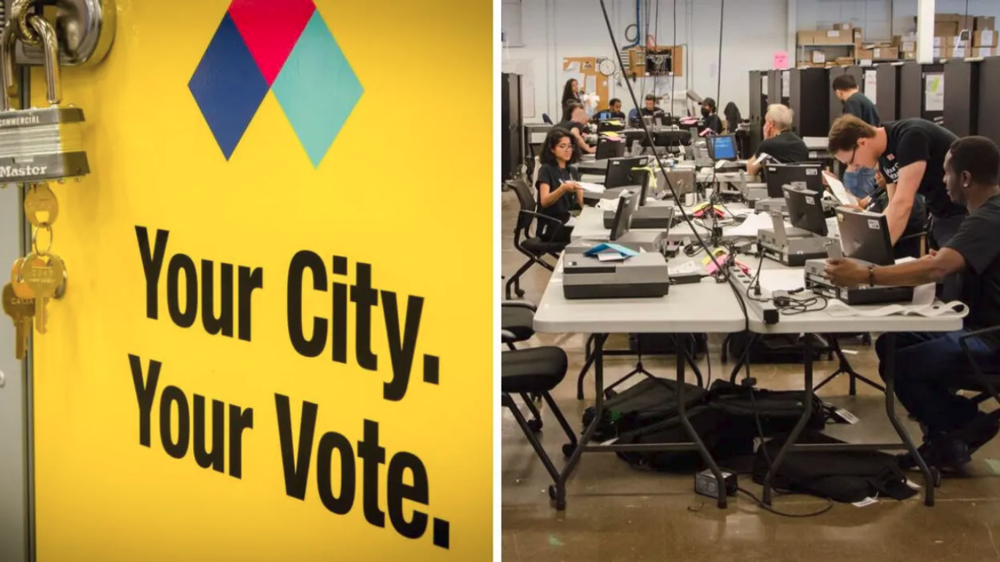

Municipal Socialist Alliance candidate, Corey David, 34, is officially running for City Council in the Scarborough Southwest, Ward 20 by-election. He submitted the required nomination signatures and candidate fee at Toronto City Hall on Wednesday, September 20 at 10 a.m., and then addressed MSA members and the media.

For more information or campaign support, Corey can be reached via email info[at]corey-david[dot]ca.
