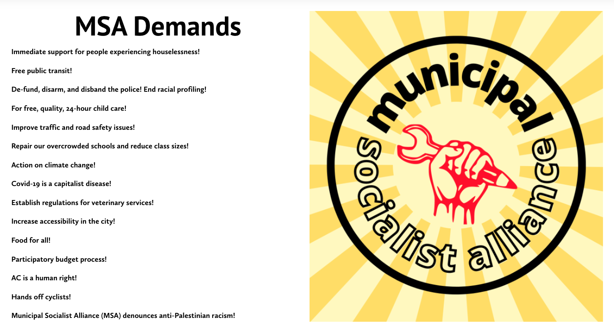

Toronto City Council called the by-election to fill the vacated seat of Gary Crawford, a conservative Councillor who ran unsuccessfully in a provincial by-election.

Corey David, who was the MSA candidate in October 2023, is now seeking the nomination for the election that will occur this Fall. On September 8, 2023 at the special MSA meeting, members nominated Corey David to fill the vacancy left by councillor Gary Crawford.

For more information or campaign support, MSA can be reached via email MunicipalSocialistAlliance[at]gmail[dot]com.
