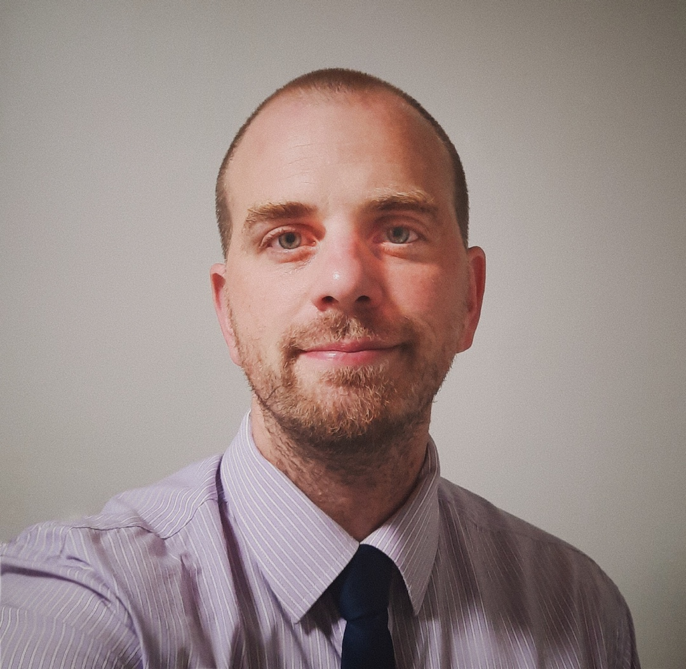

I’m committed to run as a Socialist Action candidate that looks to create a better life for workers, the poor, and the oppressed.

My priorities will be confronting the profiteering and exploitation of housing by corporations and shareholders; fighting for development and housing regulation that is for the public and by the public; fighting for a path to end homelessness and create a better system than the severely underfunded and dehumanizing shelter system we have.

To recognize and work with First Nations communities to respect their sovereign land and rectify the historic injustice committed against them that continues to attack them to this day. To denounce racism in all its forms and fight for equality for all.

To campaign to defund and disarm the police and create more transparency and independent reviews of police actions.

To demand the province properly fund the education system, to get rid private schools and bring the Catholic school board into the public system so all of Toronto’s children have equal opportunity, and to look at better protecting children and educators during pandemic by opening up and acquiring community spaces.

I stand against all development and industry that does not adequately consider environmental impact, to protect natural space and bring community members to the table in regards to changes in their neighbourhoods.

I will stand with workers wherever they struggle for better and more equitable working condition, including workplace democracy and strike actions. To work with small business and industry that is vital to Toronto Communities and to develop strategies to keep their doors open in a safe and responsible way.

There is always more; we live under an unjust system but together we can make a better world possible.

In Solidarity,

Corey David
