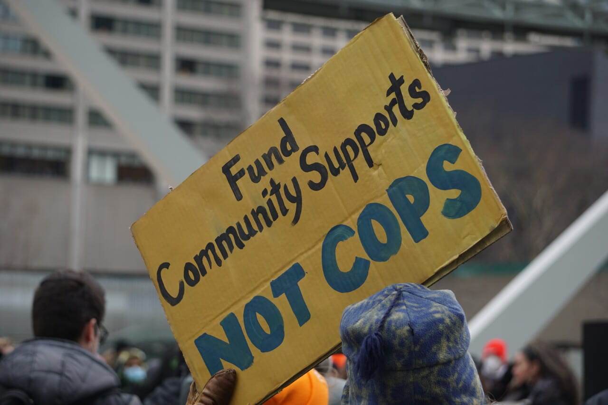

Why does poverty exist in our modern society, and why can’t we take care of each other? Why can’t we meet workers' and poor people’s basic needs, including dignity? The reason is that we live in a system that venerates the rights of property over people. The working class in Toronto is clearly being extorted by landlords, by multi-billion-dollar grocery chains, and, at the top, by giant banks. How is this the case when working people are the vast majority while also being reduced to the margins, as living costs exceed wages and there are scarce quality job opportunities for the essential maintenance of our public support systems?

It is the police who enforce the system of exploitation protecting banks, landlords, corporations, and even bigots from equity and justice. They target tenant organizers, the under-housed, community advocates, organized worker activists, and minority and low-income areas with force and intimidation to maintain the status quo. Their budget has continued to grow as they become more militarized, along with the increasing use of private security companies, while most other public institutions and services see cuts.

We need to attack the source of the crisis by improving the quality of life of the vast majority of residents in this city and meeting their basic needs. Along with other equity-seeking policies, we need to reallocate the police budget into social and public infrastructure to build up our communities and empower them to develop through the distribution of decision-making assets, including security needs. I will cheer any reduction to the police, but I am also committed to not supporting any police budget—to me, supporting a police budget would be a betrayal to all those they deliver misery upon, and empowering the police is a roadblock on the path to a working class government. Marginalized people and those struggling for a better world know that it is we who keep us safe.
