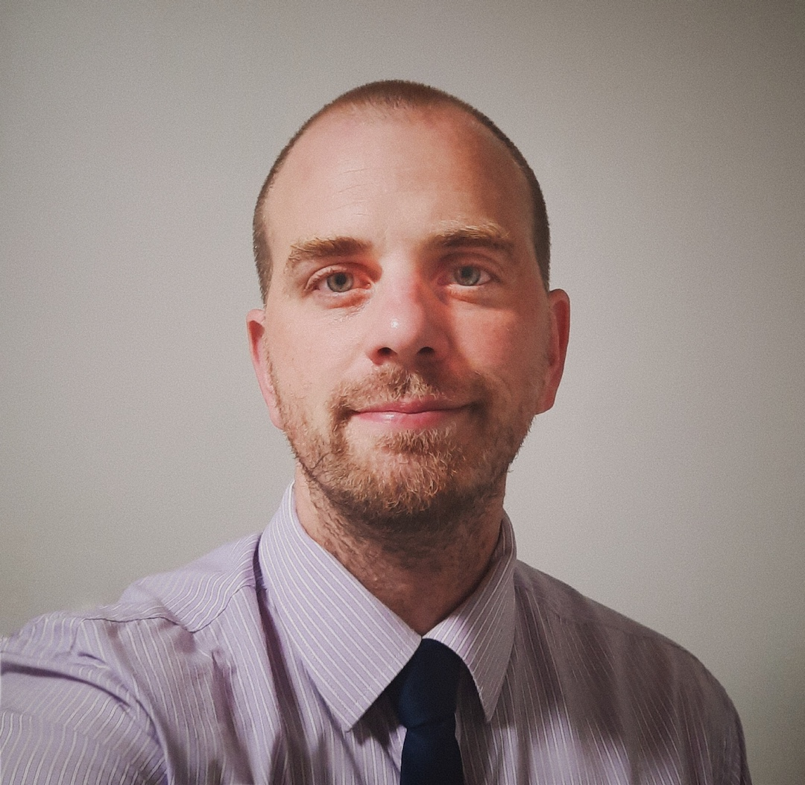

Corey David, a Toronto Council candidate in the Scarborough Southwest byelection on Nov. 30, answers four questions from Beach Metro Community News.

QUESTION 1: Please tell our readers a little bit about yourself and why you decided to run in this byelection?

I’ve lived most of my life in Birch Cliff and the rest around the GTA. I worked in group homes and the TDSB supporting individuals with disabilities for about seven years, then another seven as a machinist. I am now driving a streetcar. I’ve been in the NDP for about seven years working on various campaigns and outreach but, recently I’ve put more energy into the socialist org I belong to (Socialist Action), organizing and supporting social justice movements.

I was beaten by police in 2021 following the violent clearing of underhoused people from a park. Charges have been dropped but the injustice remains. I believe in the emancipation of the working class from the capitalist system and in the liberation of oppressed people around the world from colonialism and imperialism with the cry for Palestinian liberation being especially important in the face of Israeli actions, I stand with the oppressed.

There is no other candidate standing for the interests of the working class.

QUESTION 2: If elected councillor, how will you address concerns regarding increasing density along Kingston Road through the Birch Cliff and Cliffside areas that is seeing affordable, low-rise rental apartment buildings being replaced by condominiums of nine storeys and more?

We need housing regulation to freeze rent and a rent to own program, so tenants can actually own their home instead of enriching property owners and banks.

I’d bring life back to cooperative housing. I would diminish the private housing sector to prevent them from extorting workers and marginalized people. I would have the community decide on how to implement policy maintaining necessary resources, including parks, nature, libraries, schools, markets, as well as roads, paths rail and housing.

Congestion due to chronic poor planning and inadequate support from multiple governments and institutions will require a major intervention to resolve.

I would advocate for major investment in transit infrastructure.

QUESTION 3: How do you view potential measures, including but not limited to property tax increases, to address Toronto’s budget deficit, and what alternative strategies would you propose for the city to navigate its financial crisis?

I am in favour of progressive property taxes and additional taxes like mansion taxes, and multiple unit taxes. I will not support any budget for police and would argue that money be moved to address the various shortfalls in city services and resources.

I would propose connecting business with public institutions and resources to find more efficient and productive ways for the city to deliver services and products that the people of the city need, and can be a link in a system of exchange across the region in the aim of strengthening regional economy with a mandate to serve the public and not corporate interests.

QUESTION 4: What is the most important issue that you think you will be able to have an influence on if elected as the new councillor for Scarborough Southwest?

Housing is the most important issue facing workers and marginalized people in this city. Housing is a foundation to life, it is shelter, it is a base from which to operate in the world, it is a basic need.

Unfortunately like most of the world it is used in combination with systems of exploitation to extort people for the ground under them. I have no illusions that there is a cost to housing, but in reality it is a manageable responsibility, not this fake criminal system of the hoarders. I would do everything I can to put housing along with community power into the hands of residents using previously mentioned mechanisms, but also by leveraging the governments mandate as the representative of the people and responsibility to protecting them from predatory actors and institutions. Social housing is a net gain for the community and it is the right thing to do.

For more candidate answers, please go to https://beachmetro.com/
